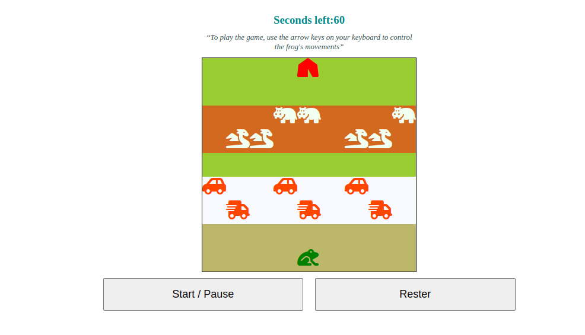

# Frogger

"Welcome to **Frogger!** The objective of this game is to help a frog cross a busy road and reach its home. The frog must avoid cars and trucks moving in different directions on the road, as well as Dragons and Hippo :D in the river.

To play the game, use the arrow keys on your keyboard to control the frog's movements. Move the frog up, down, left, or right to navigate around obstacles. Make sure to reach the other side of the road without getting hit by any of the moving vehicles or falling into the water.

Every time the frog reaches its home, it earns 1 point and 5 additional seconds. The game ends if the frog is hit by a car, falls into the water, or if time runs out.

> Good luck, and have fun playing **Frogger!**"

