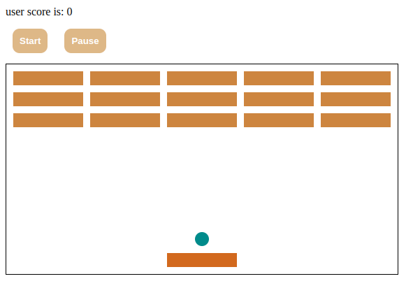
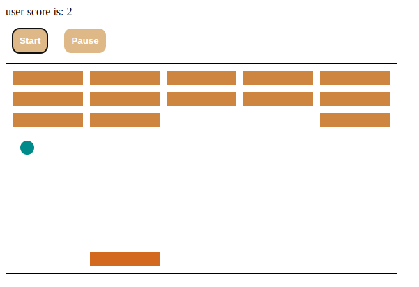
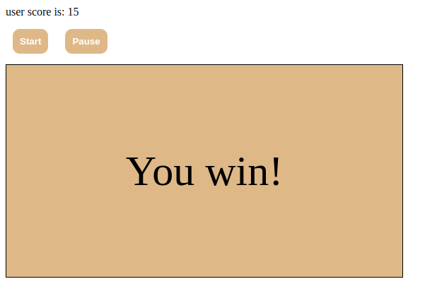
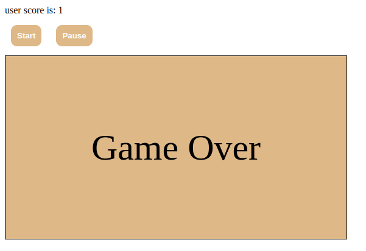

# Breakout

> you have to click start to start the game and you can pause/resume it if you clicked on pause button

> in the end of the game you get the final score

> the player has lost the game

